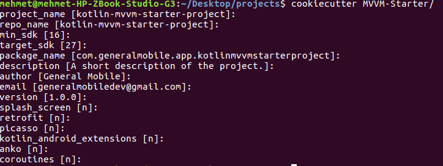

# Android Kotlin MVVM Starter

[](http://developer.android.com/index.html)


Android Kotlin Starter is a starter project which implements MVVM Pattern.  


## Libraries
It includes libraries
- [RxJava2](https://github.com/ReactiveX/RxJava) and [RxAndroid](https://github.com/ReactiveX/RxAndroid) and [RxKotlin](https://github.com/ReactiveX/RxKotlin) 
- [Retrofit](http://square.github.io/retrofit/) / [OkHttp](http://square.github.io/okhttp/)
- [Gson](https://github.com/google/gson)
- [Dagger 2](http://google.github.io/dagger/)
- [Timber](https://github.com/JakeWharton/timber)
- [Crashlytics](https://try.crashlytics.com/)
- [Picasso](http://square.github.io/picasso/)
- [Anko](https://github.com/Kotlin/anko)
- [Coroutines](https://github.com/Kotlin/kotlinx.coroutines)
- [Android Jetpack Architecture Components](https://developer.android.com/jetpack/arch/)
- [Espresso](https://google.github.io/android-testing-support-library/) for UI tests

**You can choose which library you want to include in your project**



#### Requirements

[python](https://www.python.org/)  
[pip](https://pypi.python.org/pypi/pip)  
[cookiecutter](https://github.com/audreyr/cookiecutter)  

#### Install
```
1. Install python
2. Install pip
3. pip install cookiecutter
```

Scaffold your project:
```
cookiecutter https://github.com/general-mobile/kotlin-android-mvvm-starter.git
```


##### Project Tree After Scaffold
```bash

├── app
│   ├── build.gradle
│   ├── proguard-rules.pro
│   └── src
│       ├── androidTest
│       │   └── java
│       │       └── com
│       │           └── generalmobile
│       │               └── app
│       │                   └── kotlinmvvmstarterproject
│       │                       └── ApplicationTest.java
│       ├── main
│       │   ├── AndroidManifest.xml
│       │   ├── kotlin
│       │   │   └── com
│       │   │       └── generalmobile
│       │   │           └── app
│       │   │               └── kotlinmvvmstarterproject
│       │   │                   ├── Application.kt
│       │   │                   ├── core
│       │   │                   │   ├── BaseActivity.kt
│       │   │                   │   ├── BaseAdapter.kt
│       │   │                   │   ├── BaseDiffCallback.kt
│       │   │                   │   ├── BaseEntity.kt
│       │   │                   │   ├── BaseFragment.kt
│       │   │                   │   ├── BasePagedListAdapter.kt
│       │   │                   │   ├── BaseViewHolder.kt
│       │   │                   │   └── BaseViewModel.kt
│       │   │                   ├── db
│       │   │                   │   ├── AppDatabase.kt
│       │   │                   │   ├── dao
│       │   │                   │   │   └── ExampleDao.kt
│       │   │                   │   └── entities
│       │   │                   │       └── Example.kt
│       │   │                   ├── di
│       │   │                   │   ├── component
│       │   │                   │   │   └── ApplicationComponent.kt
│       │   │                   │   ├── module
│       │   │                   │   │   ├── ApplicationModule.kt
│       │   │                   │   │   ├── DatabaseModule.kt
│       │   │                   │   │   └── NetModule.kt
│       │   │                   │   └── scope
│       │   │                   │       └── ActivityScope.kt
│       │   │                   ├── ui
│       │   │                   │   ├── main
│       │   │                   │   │   ├── MainActivityViewModel.kt
│       │   │                   │   │   └── MainActivity.kt
│       │   │                   │   └── splash
│       │   │                   │       └── SplashActivity.kt
│       │   │                   └── utils
│       │   │                       └── service
│       │   │                           └── CallbackWrapper.kt
│       │   │                       └── timber
│       │   │                           └── CrashReportTree.kt
│       │   └── res
│       │       ├── drawable
│       │       │   ├── android_starter.png
│       │       │   └── splash_logo.xml
│       │       ├── layout
│       │       │   └── activity_main.xml
│       │       ├── mipmap-hdpi
│       │       │   ├── ic_launcher.png
│       │       │   └── ic_launcher_round.png
│       │       ├── mipmap-mdpi
│       │       │   ├── ic_launcher.png
│       │       │   └── ic_launcher_round.png
│       │       ├── mipmap-xhdpi
│       │       │   ├── ic_launcher.png
│       │       │   └── ic_launcher_round.png
│       │       ├── mipmap-xxhdpi
│       │       │   ├── ic_launcher.png
│       │       │   └── ic_launcher_round.png
│       │       ├── mipmap-xxxhdpi
│       │       │   ├── ic_launcher.png
│       │       │   └── ic_launcher_round.png
│       │       ├── values
│       │       │   ├── colors.xml
│       │       │   ├── dimens.xml
│       │       │   ├── strings.xml
│       │       │   └── styles.xml
│       │       ├── values-v21
│       │       │   └── styles.xml
│       │       └── values-w820dp
│       │           └── dimens.xml
│       └── test
│           └── java
│               └── com
│                   └── generalmobile
│                       └── app
│                           └── kotlinmvvmstarterproject
│                               └── ExampleUnitTest.java
├── build.gradle
├── gradle
│   └── wrapper
│       ├── gradle-wrapper.jar
│       └── gradle-wrapper.properties
├── gradle.properties
├── gradlew
├── gradlew.bat
└── settings.gradle

46 directories, 47 files


## License

    The MIT License (MIT)
    
    Copyright (c) 2018 General Mobile
    
    Permission is hereby granted, free of charge, to any person obtaining a copy
    of this software and associated documentation files (the "Software"), to deal
    in the Software without restriction, including without limitation the rights
    to use, copy, modify, merge, publish, distribute, sublicense, and/or sell
    copies of the Software, and to permit persons to whom the Software is
    furnished to do so, subject to the following conditions:
    
    The above copyright notice and this permission notice shall be included in all
    copies or substantial portions of the Software.
    
    THE SOFTWARE IS PROVIDED "AS IS", WITHOUT WARRANTY OF ANY KIND, EXPRESS OR
    IMPLIED, INCLUDING BUT NOT LIMITED TO THE WARRANTIES OF MERCHANTABILITY,
    FITNESS FOR A PARTICULAR PURPOSE AND NONINFRINGEMENT. IN NO EVENT SHALL THE
    AUTHORS OR COPYRIGHT HOLDERS BE LIABLE FOR ANY CLAIM, DAMAGES OR OTHER
    LIABILITY, WHETHER IN AN ACTION OF CONTRACT, TORT OR OTHERWISE, ARISING FROM,
    OUT OF OR IN CONNECTION WITH THE SOFTWARE OR THE USE OR OTHER DEALINGS IN THE
    SOFTWARE.
